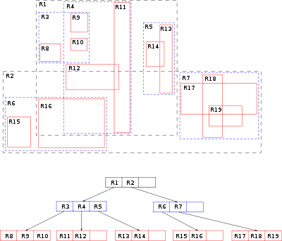

# Шаг 0. Что такое LRU, R-tree и постановка задачи 

## Задача
Нужна База данных для того, чтобы хранить геоданные в следующем формате
### Формат данных
```Go
type (
    Location struct {
        Latitude float64 `json:"lat"`
        Longitude float64 `json:"lon"`
    }

    Payload struct {
      Timestamp int64 `json:"timestamp"`
      DriverID int `json:"driver_id"`
      Location Location `json:"location"`
    }
)
```

### Требования к хранению

1. Данные должны добавляться без дублирования.
2. По каждому водителю нужно хранить N последних точек

Добавления данных будет через HTTP API

### Требования к HTTP API

1. Добавить данные в хралищие
2. Получить информацию по водителю
3. Получить ближайших водителей по местоположению

## Разбор задачи
Как я могу предположить здесь есть два пункта, которые не совсем вам понятны. Скорее всего не понятны следующие вещи:

1. По каждому водителю нужно хранить N последних точек
2. Получить ближайших водителей по местоположению

Первую задачу можно решить многими путями от того, чтобы держать массив в памяти, до того, чтобы сделать key-value кеш. Я предлагаю решить задачу, сделав `LRU cache`.

### Что такое LRU

LRU (least recently used) — это алгоритм кеширования данных, при котором вытесняются значения, которые дольше всего не запрашивались. Этот механизм удобен тем, что мы например инициализируем кеш на 20 элементов. И как только мы стараемся добавить 21й, то самый долго неиспользуемый элемент удалится.

Этот механизм удобен еще тем, что эту логику мы реализуем только в одном месте. 

Касаемо второй задачи, у нас есть несколько вариантов ее решения

1. Наивный. Мы берем и проходим по всем значениям в памяти, расчитывая растояние и выдаем N ближайших
2. Мы используем какой-нибудь гео индекс, который решит за нас эту проблему.

Для второго варианта, давайте рассмотрим R-tree

## R-tree


R-tree выглядит как показано на картинке. Это древовидная структура данных. Она хороша для понимания, если вы знакомы с B-деревом. R-tree нужно для индексации пространственных данных(координаты, города на карте). Также она решает нашу проблему. У нее можно спросить "Дай мне 10 ближайших водителей рядом со мной". Она идеально подходит для нас.
[Подробнее](https://ru.wikipedia.org/wiki/R-%D0%B4%D0%B5%D1%80%D0%B5%D0%B2%D0%BE_(%D1%81%D1%82%D1%80%D1%83%D0%BA%D1%82%D1%83%D1%80%D0%B0_%D0%B4%D0%B0%D0%BD%D0%BD%D1%8B%D1%85))

## Поздравляю
Мы узнали какую задачу будем решать и как ее решать. Приступим к реализации задачи в [следующем шаге](../step01/README.md)
